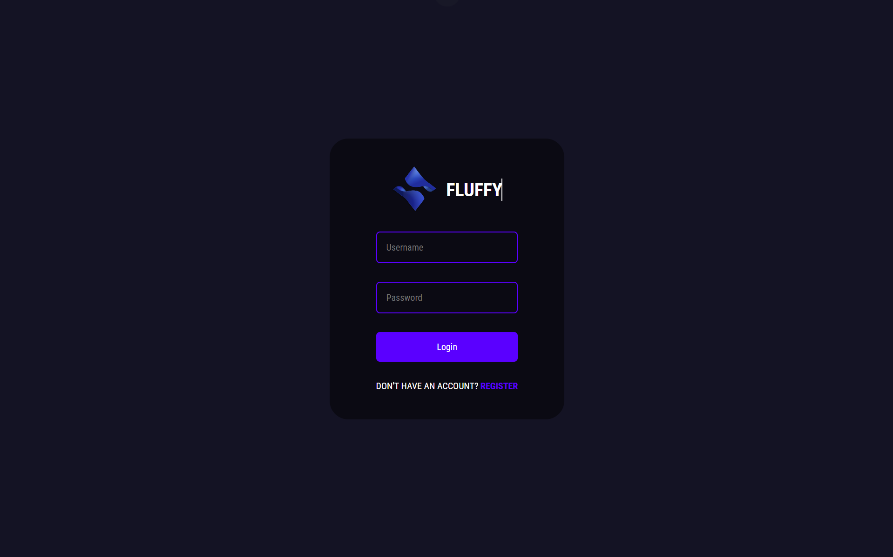
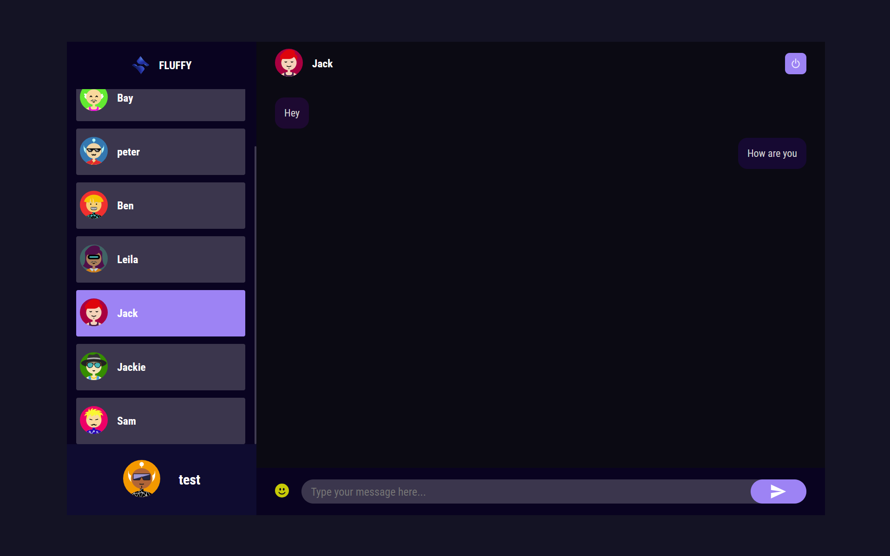

# Fluffy - Chat Application

Welcome to my ChatApp! 👋

Fluffy is a feature-rich chat application built with the MERN stack (MongoDB, Express.js, React.js, Node.js). The goal of this project is to provide users with a seamless and interactive chat experience. Whether you're chatting with friends, colleagues, or building communities, this application offers a simple and intuitive interface.

This project was developed to deepen my understanding of full-stack development, focusing on integrating real-time messaging features, handling user authentication, and creating a responsive UI.

Here are some pictures of the login page and the chat page.






## Features

- Real-time messaging with **Socket.IO**
- User authentication with **JWT**
- Avatar selection for user profiles
- Responsive design using **React** and **Styled Components**
- RESTful API using **Express** and **MongoDB**


## Installation Guide

### Requirements
- [Node.js](https://nodejs.org/en/download)
- [MongoDB](https://www.mongodb.com/docs/manual/administration/install-community/)

Ensure both are installed, and MongoDB is running in the background.

### Installation Steps

#### 1. Clone the repository:

   ```shell
   git clone https://github.com/joyal99/ChatApp.git
   cd ChatApp
   ```

#### 2. Install Dependencies for both frontend and backend

Make sure to have two terminals open. One should be in the /public directory and one in the /server directory.

#### Install dependencies for backend

```shell
cd server
npm install
```

#### Install dependencies for frontend

```shell
cd public
npm install
```

#### 3. Start the development servers:

For Frontend (/public directory):
```shell
npm start or npm run start
```

For Backend (/server directory):
```shell
npm start or npm run start
```

#### 4. Ensure MongoDB is running:
Make sure MongoDB is running in the background to support the backend.

5. Access the application:
Once the servers are running, open your browser and navigate to:
```shell
http://localhost:3000
```

